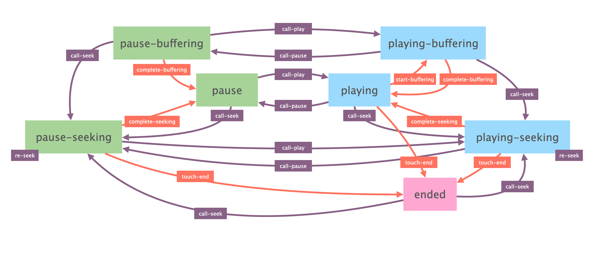
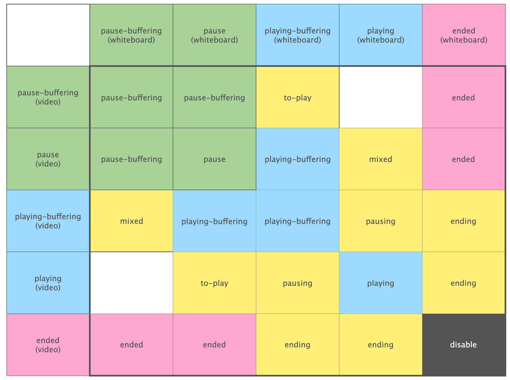
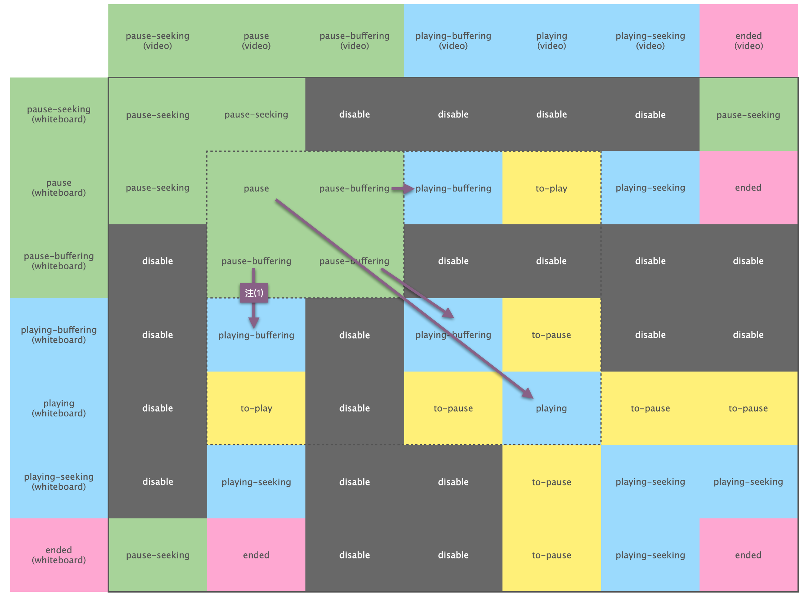
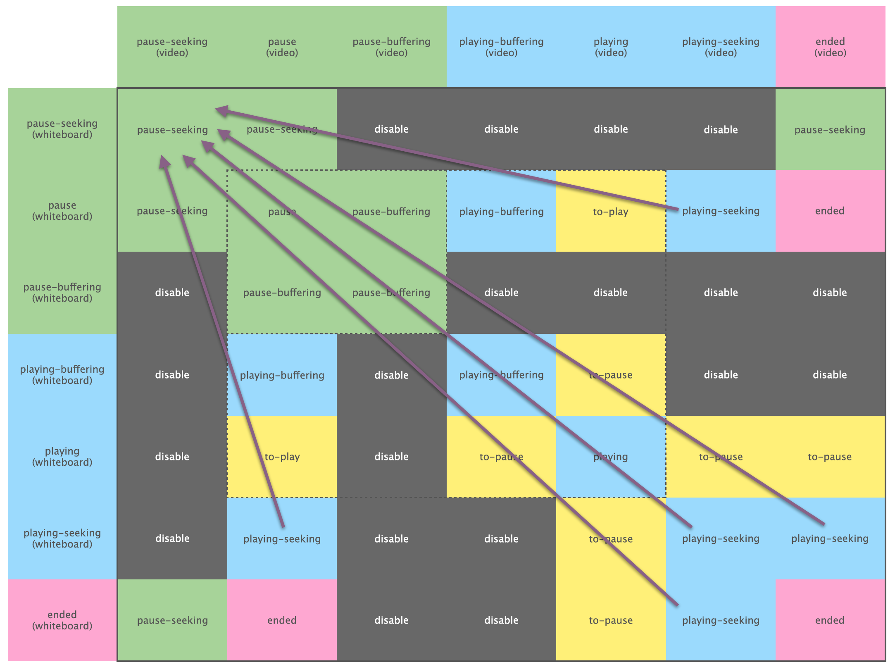
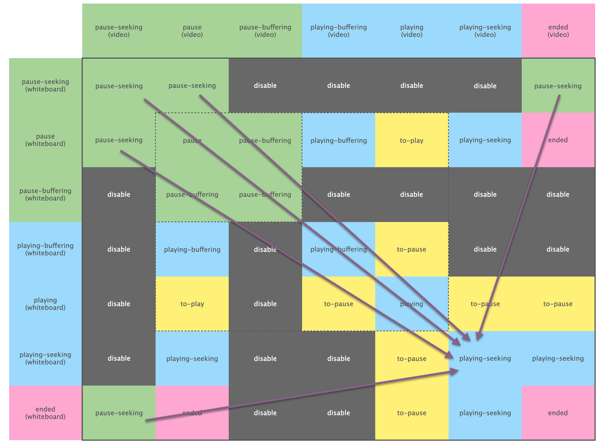
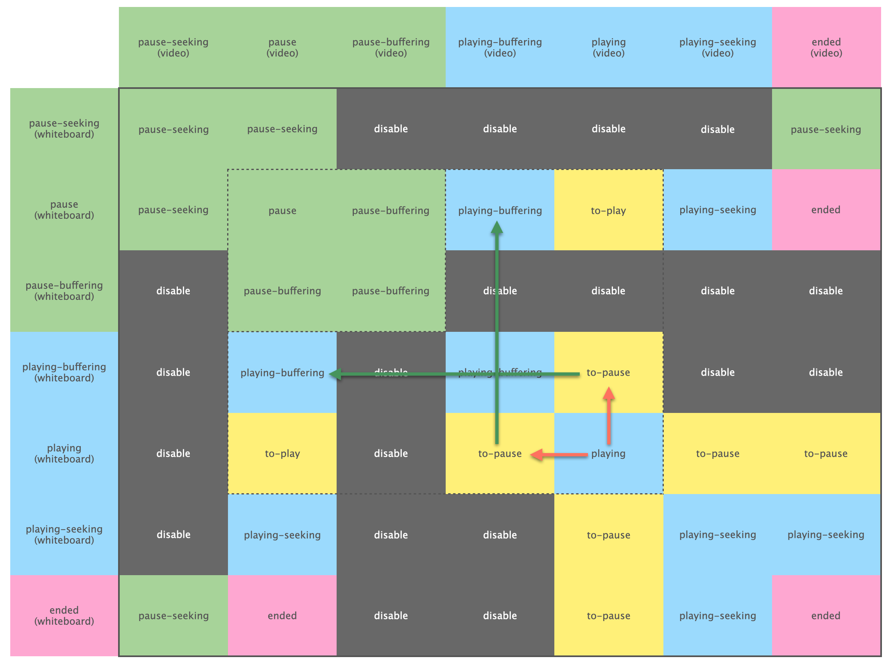
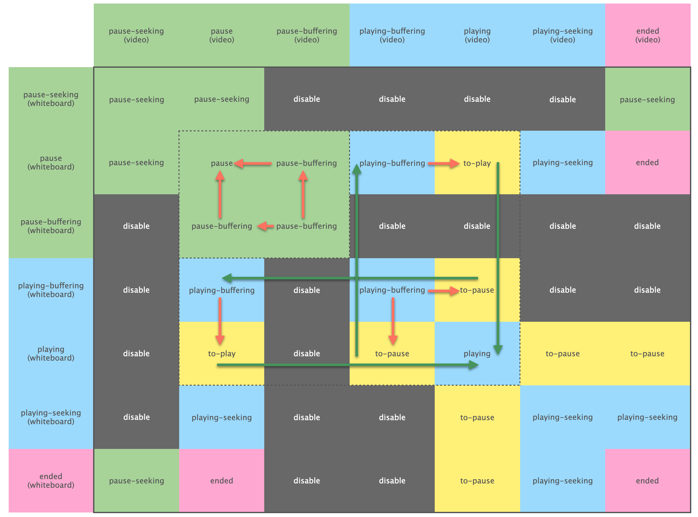
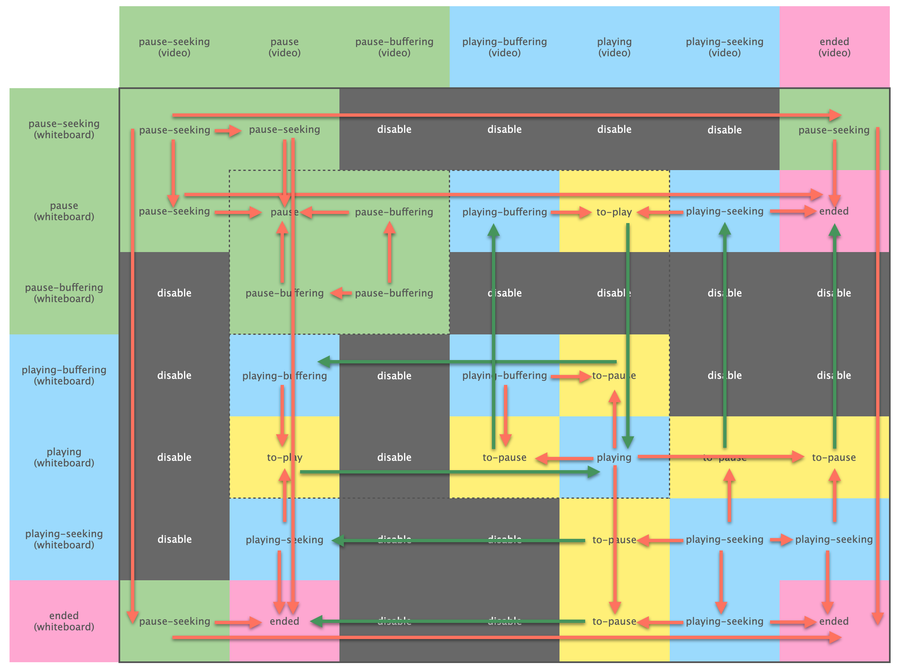

# 状态机架构

## 原子播放器的状态机

video player 和 whiteboard player 都是原子播放器。在本库中，它们状态机及行为是完全相同的。如果不相同，就用适配器代码让它们相同。因此在本章节中，对它们不做区分，一律视为原子播放器。

原子播放器是一个[有限状态机](https://zh.wikipedia.org/zh-hans/有限状态机)，它有可穷举「状态」，在发生「事件」时，状态会发生改变。特别的，我们认为事件必须处于特定状态下才可能发生。所有可能的状态和事件，都穷举于如下图。

### 状态描述

我们用不同颜色描述不同状态。绿色表示，播放器整体处于暂停状态，此时可以响应用户的播放操作。蓝色表示，播放器整体处于播放状态，此时可以响应用户的暂停操作。粉红表示结束播放，不再响应暂停和播放。

所有状态的描述如下。

| 名称               | 描述                      |
| :---------------- | :------------------------ |
| pause             | 暂停，但缓存足够，随时可以播放 |
| pause-buffering   | 暂停，但缓存不足以立即播放    |
| pause-seeking | 跳转中，完成跳转后，保留暂停状态 |
| playing           | 正在播放，缓存充足           |
| playing-buffering | 正在缓存，但缓存完后会立即播放 |
| playing-seeking | 跳转中，完成跳转后，保留播放状态 |
| ended             | 播放完全部内容              |

### 事件描述

事件分为两种，我们用不同颜色描述。其一，橙色的被动事件，这类是系统自动调用的，我们无法预料它发生的时机。其二，紫色的主动调用事件，这类由用户主动调用。

我们认为，特定事件只能在特定状态下发生（具体见状态机图）。若被动事件违反，则应该报错，但如果程序设计正确或我们对播放器理解足够正确，这种事情不应该发生。若主动事件违反，则应该什么都不做，视为拒绝掉了用户的调用。

所有事件的描述如下。

| 名称                | 描述                      |
| :----------------- | :------------------------ |
| start-buffering    | 缓存区不足，开始缓存         |
| complete-buffering | 缓存区足够，停止缓存         |
| complete-seeking | 完成跳转 |
| touch-end          | 到达末尾，再无内容可播 |
| call-play          | 用户调用「播放」操作         |
| call-pause         | 用户调用「暂停」操作         |
| call-seek          | 用户调用「跳转」操作         |

## 组合播放器状态机

用两个原子播放器的状态做笛卡尔积，得到组合播放器的状态机。这是由 5 * 5 = 25 个状态组合而成的状态机，我们用 ``(n, m)`` 来描述某个特定的组合状态。例如，2 行 3 列的状态，就叫做 ``(2,3)``。

**特别的，组合状态机的状态完全依赖于原子状态机的状态**。换而言之，它是被动，无法主动变化。我们不能操作组合状态机从一个状态跳转到另一个状态。我们只能操作某个原子播放器，让它从一个状态跳转到另一个状态，从而引发组合状态机的变化。

此外，原子播放器的被动事件会导致原子状态机的状态变化，这将导致组合状态机的状态变化。这种情况随时随地都可能发生，我们必须为此作出万全的准备。

如图，黑框所在区域是组合状态机的状态，两侧（纵、横）分别是 whiteboard、video 的原子状态机。组合状态机的每一个状态都由黑框的一个格子表示，通过格子的纵、横延长线交于原子状态机，可以得知该组合状态由哪两个原子状态组合而来。

每个组合状态都有一个名字。**但请注意，同名格子并不能代表相同的组合状态**。例如，``(3, 4)`` 和 ``(4, 3)`` 都叫 ``pausing`` ，但它们是**完全不同**的状态。

组合状态的格子也有颜色，不同颜色有不同的含义。

- **蓝色**：播放器正在播放，可以接受用户的「暂停」操作。
- **绿色**：播放器暂停，可以接受用户的「播放」操作。
- **粉红**：内容已播完。
- **黄色**：瞬时状态。进入该状态后，会立即操作某个原子播放器，从而立即脱离该状态。
- **黑色**：非法状态。不可能进入的状态（如果进入，程序肯定出了问题）。

### 设计目标

原子状态机状态变化来自两方面：主动事件、被动事件。其中主动事件来自外部调用，由于原子播放器被我们封装了，我们自己不调用，就没人会调用。但被动事件就不可控了，则取决于原子播放器的行为，我们要做好这些事件随时发生的准备。

我们研究组合状态机的二维状态表格，是为了达成如下三个目标。

1. 封装主动调用。将外部对组合播放器的主动调用（``call-play``、``call-pause``、``call-seek``）封装成对某个原子播放器的主动调用。这个封装必须符合预期。
2. 穷举并排查每一个格子，确保在该格子上发生被动事件后，整个状态机的行为合乎预期。
3. 设计黄色格子的行为，以满足 1. 和 2. 提出的要求。

### 黄色格子的行为

当状态改变成黄色格子对应的状态时，会立即调用某个原子播放器的某个方法，从而脱离该状态。具体如何调用，每个黄色格子各有各的不同。

1. ``to-play (5, 2)`` 调用 ``whiteboard`` 的 ``play`` 方法。
2. ``to-play (2, 5)`` 调用 ``video`` 的 ``play`` 方法。
3. ``to-pause (5, 4)`` 调用 ``video`` 的 ``pause`` 方法。
4. ``to-pause (4, 5)`` 调用 ``whiteboard`` 的 ``pause`` 方法。
5. ``to-pause (5, 6)`` 调用 ``video`` 的 ``pause`` 方法。
6. ``to-pause (6, 5)`` 调用 ``whiteboard`` 的 ``pause`` 方法。
7. ``to-pause (5, 7)`` 调用 ``video`` 的 ``pause`` 方法。
8. ``to-pause (7, 5)`` 调用 ``whiteboard`` 的 ``pause`` 方法。

## 播放与暂停操作

对于 ``call-play`` 和 ``call-pause`` 事件，应该被封装成调用特定原子播放器的 ``play`` 或 ``pause`` 方法来实现。可以通过原子状态机的行为预测，组合状态机的状态会做如图跳转。

> 在跳转过程中，由于原子状态机的状态不会同时变化，因此可能出现不符合预期的中间状态。这对于图中走斜线（而非纵向、横向）的箭头而言，是一定会出现。在这里必须用到一些编码技巧，隐藏这个中间状态。

- **注(1)**：当组合播放器第一次调 ``call-play`` 时，必须调用 ``video`` 的 ``play`` 方法，以激活它。否则，因为浏览器的安全机制的限制，之后调用 ``video`` 的 ``play`` 方法时浏览器会报错。该箭头表明，此时只会调用 ``whiteboard`` 的 ``play`` 方法，这显然是有隐患的。这里，如果发现 ``video`` 的 ``play`` 方法从未被调用，应该立即对 ``video`` 调用 ``play``，然后紧接着立即调用 ``pause``，最后再对 ``whiteboard`` 调用 ``play``。

## 跳转中的事件

当用户对组合播放器调用 ``seek`` 方法时，应该封装成对原子播放器的 ``seek`` 调用。

- **注(1)**：这两个斜向箭头中，一个原子播放器的状态是 ``pause``，另一个是 ``playing-buffering``。这让状态为 ``pause`` 的播放器不可能一步跳转到 ``playing-seeking`` 的状态（观察状态机图，的确无法一步至此）。此时需要对他连续调用 ``seek`` 和 ``play`` 方法，才能达到目标状态。

此外，若组合状态机处于 ``playing-seeking`` 时，调用 ``pause`` 方法，需要进行如下图条状。

此外，若组合状态机处于 ``pause-seeking`` 时，调用 ``play`` 方法，需要进行如下图条状。

### 被动事件

某个原子播放器接收到 ``start-buffering`` 事件。

某个原子播放器接收到 ``complete-buffering`` 的情况。

某个原子播放器接收到 ``complete-seeking`` 的情况。

某个原子播放器接收到 ``touch-end`` 的情况。

## 被动事件查漏补缺

如下图列出了所有被动事件会引发的状态变化，以及因为跳转到黄色格子而导致的操作。被动事件随时随地可能会发生，我们穷举出所有可能的被动事件，并预测它可能带来的影响。通过如下图，我们可以论证说，我们的组合状态机是符合预期的。

