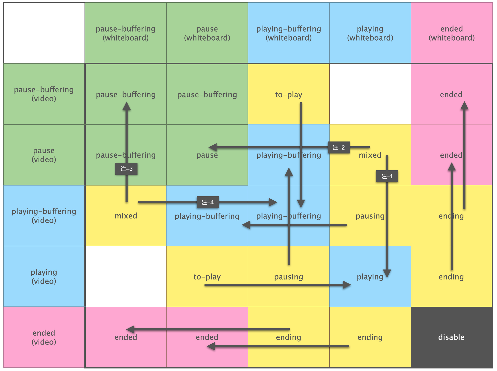
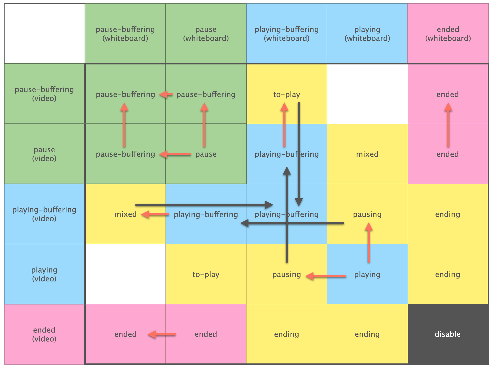
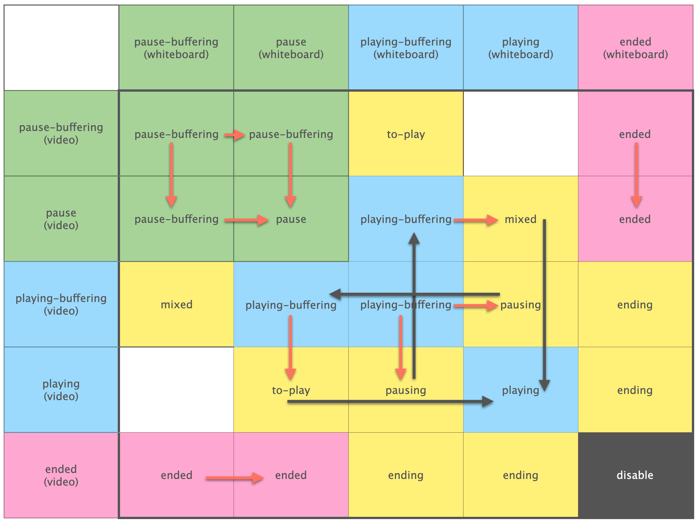
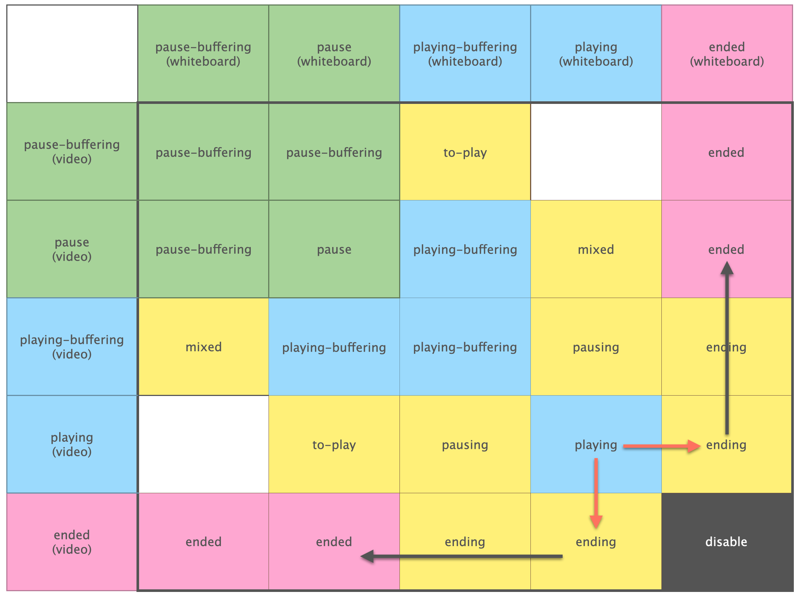
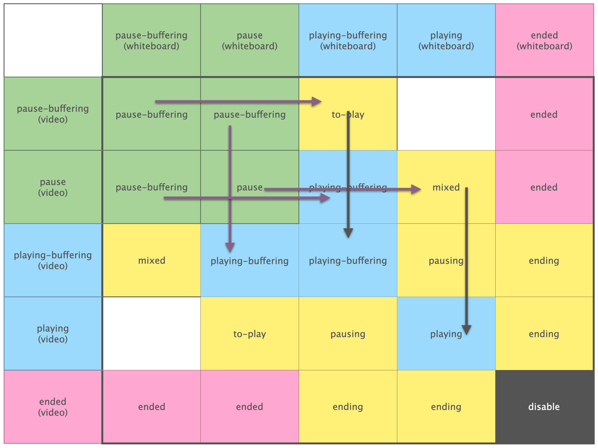
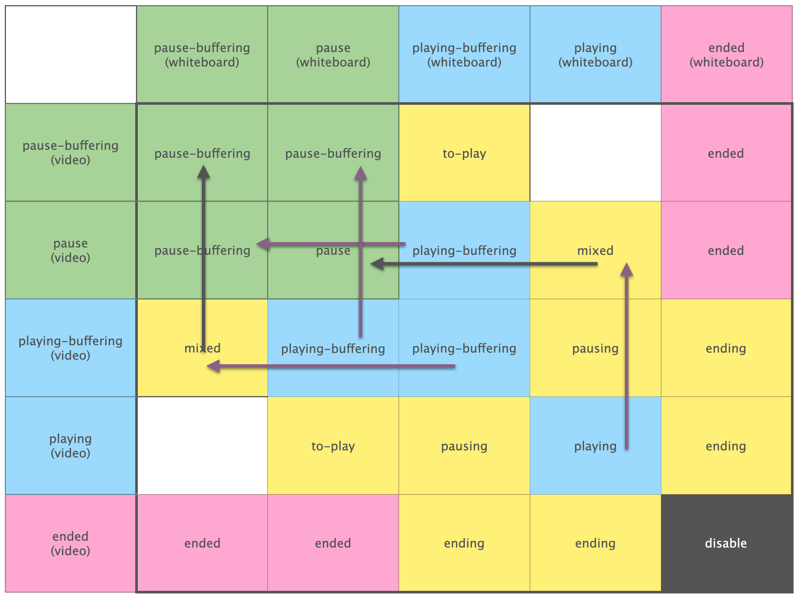
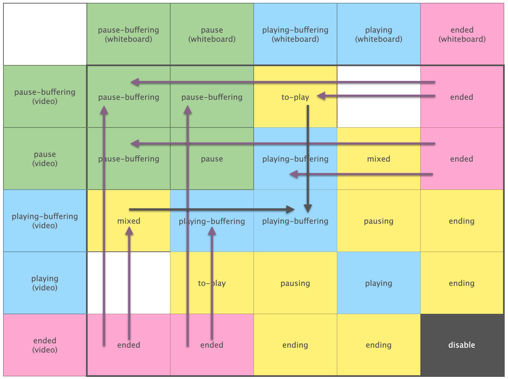
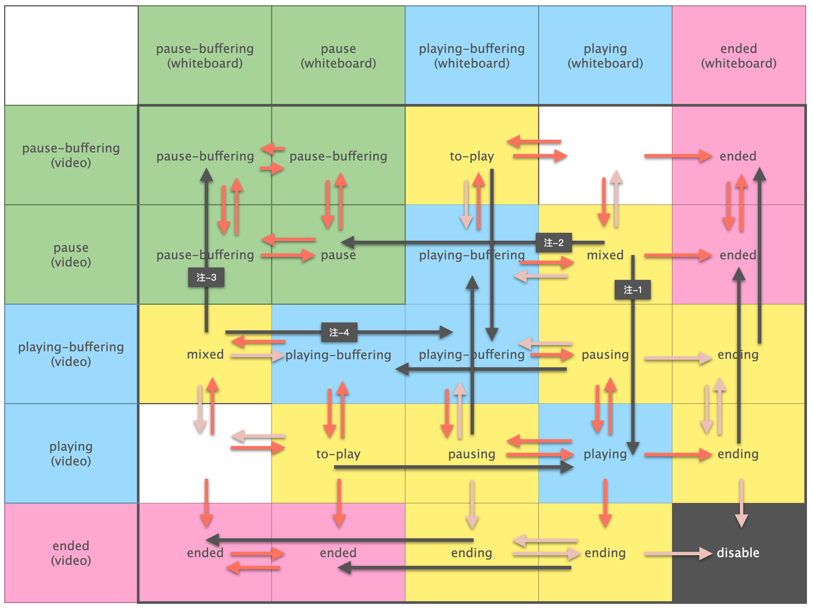

# 状态机架构

## 原子播放器的状态机

video player 和 whiteboard player 都是原子播放器。在本库中，它们状态机及行为是完全相同的。如果不相同，就用适配器代码让它们相同。因此在本章节中，对它们不做区分，一律视为原子播放器。

原子播放器是一个[有限状态机](https://zh.wikipedia.org/zh-hans/有限状态机)，它有可穷举「状态」，在发生「事件」时，状态会发生改变。特别的，我们认为事件必须处于特定状态下才可能发生。所有可能的状态和事件，都穷举于如下图。

### 状态描述

我们用不同颜色描述不同状态。绿色表示，播放器整体处于暂停状态，此时可以响应用户的播放操作。蓝色表示，播放器整体处于播放状态，此时可以响应用户的暂停操作。分红表示结束播放，不再响应暂停和播放。

| 名称               | 描述                      |
| :---------------- | :------------------------ |
| pause             | 暂停，但缓存足够，随时可以播放 |
| pause-buffering   | 暂停，但缓存不足以立即播放    |
| playing           | 正在播放，缓存充足           |
| playing-buffering | 正在缓存，但缓存完后会立即播放 |

> 播放器可以拆出 ``seeking`` 状态，这种状态用于表示正在跳转。但这里我们不区分这种状态，将其归于 ``pause-buffering`` 和 ``playing-buffering``。

### 事件描述

事件氛围两种，我们用不同颜色描述。其一，橙色的被动事件，这类是系统自动调用的，我们无法预料它发生的时机。其二，紫色的主动调用事件，这类由用户主动调用。

我们认为，特定事件只能在特定状态下发生（具体见状态机图）。若被动事件违反，则应该报错，但如果程序设计正确或我们对播放器理解足够正确，这种事情不应该发生。若主动事件违反，则应该什么都不做，视为拒绝掉了用户的调用。

| 名称                | 描述                      |
| :----------------- | :------------------------ |
| start-buffering    | 缓存区不足，开始缓存         |
| complete-buffering | 缓存区足够，停止缓存         |
| touch-end          | 已播完所有内容              |
| call-play          | 用户调用「播放」操作         |
| call-pause         | 用户调用「暂停」操作         |
| call-seek          | 用户调用「跳转」操作         |

### 关于跳转（``call-seek``）

跳转的情况比较特殊。当播放器处于蓝色或绿色的状态时，直接调用 ``seek`` 操作即可。此时播放器应该会自动跳转到 ``playing-buffering`` 或 ``pause-buffering`` 之下。

但状态为 ``ended`` 的时候比较特殊。此时用户可以调用 ``pause`` 来暂停，如果此时再调用 ``seek``，则播放器应该进入 ``pause-buffering`` 状态。如果用户没有调用过 ``pause``，然后调用 ``seek``，此时应该进入 ``pause-buffering``。

我们在状态机图中，直接画出两条 ``call-seek`` 的线，可以视为将这个概念稍微封装了一下。

## 组合播放器状态机

用两个原子播放器的状态做笛卡尔积，得到组合播放器的状态机。这是由 5 * 5 = 25 个状态组合而成的状态机，我们用 ``(n, m)`` 来描述某个特定的组合状态。例如，2 行 3 列的状态，就叫做 ``(2,3)``。

**特别的，组合状态机的状态完全依赖于原子状态机的状态**。换而言之，它是被动，无法主动变化。我们不能操作组合状态机从一个状态跳转到另一个状态。我们只能操作某个原子播放器，让它从一个状态跳转到另一个状态，从而引发组合状态机的变化。

此外，原子播放器的被动事件会导致原子状态机的状态变化，这将导致组合状态机的状态变化。这种情况随时随地都可能发生，我们必须为此作出万全的准备。

如图，黑框所在区域是组合状态机的状态，两侧（纵、横）分别是 whiteboard、video 的原子状态机。组合状态机的每一个状态都由黑框的一个格子表示，通过格子的纵、横延长线交于原子状态机，可以得知该组合状态由哪两个原子状态组合而来。

每个组合状态都有一个名字。**但请注意，同名格子并不能代表相同的组合状态**。例如，``(3, 4)`` 和 ``(4, 3)`` 都叫 ``pausing`` ，但它们是**完全不同**的状态。

组合状态的格子也有颜色，不同颜色有不同的含义。

- **蓝色**：播放器正在播放，可以接受用户的「暂停」操作。
- **绿色**：播放器暂停，可以接受用户的「播放」操作。
- **粉红**：内容已播完。
- **黄色**：瞬时状态。进入该状态后，会立即操作某个原子播放器，从而立即脱离该状态。
- **白色**：瞬时状态。与黄色不同，它不会做任何操作。但设计上，进入该状态后应该立即脱离该状态。
- **黑色**：非法状态。不可能进入的状态（如果进入，程序肯定出了问题）。

### 设计目标

原子状态机状态变化来自两方面：主动事件、被动事件。其中主动事件来自外部调用，由于原子播放器被我们封装了，我们自己不调用，就没人会调用。但被动事件就不可控了，则取决于原子播放器的行为，我们要做好这些事件随时发生的准备。

我们研究组合状态机的二维状态表格，是为了达成如下三个目标。

1. 封装主动调用。将外部对组合播放器的主动调用（``call-play``、``call-pause``、``call-seek``）封装成对某个原子播放器的主动调用。这个封装必须符合预期。
2. 穷举并排查每一个格子，确保在该格子上发生被动事件后，整个状态机的行为合乎预期。
3. 设计黄色格子的行为，以满足 1. 和 2. 提出的要求。

### 黄色格子的行为

当状态改变成黄色格子对应的状态时，会立即调用某个原子播放器的某个方法，从而脱离该状态。具体如何调用，每个黄色格子各有各的不同。

1. ``to-play (3, 1)``：调用 ``video`` 的 ``play`` 方法。
2. ``to-play (2, 4)``：调用 ``whiteboard`` 的 ``play`` 方法。
3. ``pausing (4, 3)``：调用 ``whiteboard`` 的 ``pause`` 方法。
4. ``pausing (3, 4)``：调用 ``video`` 的 ``pause`` 方法。
5. ``ending (5, 3)``： 调用 ``whiteboard`` 的 ``pause`` 方法。
6. ``ending (5, 4)``： 调用 ``whiteboard`` 的 ``pause`` 方法。
7. ``ending (3, 5)``： 调用 ``video`` 的 ``pause`` 方法。
8. ``ending (4, 5)``： 调用 ``video`` 的 ``pause`` 方法。
9. ``mixed (4, 2)``：若来自 ``playing (4, 4)``，则调用 `whiteboard` 的 ``pause`` 方法「注-2」。其他情况调用 ``video`` 的 ``play`` 方法「注-1」。
10. ``mixed (1, 3)``： 若来自 ``playing (4, 4)``，则调用 `video` 的 play 方法「注-3」。其他情况调用 ``whiteboard`` 的 ``play`` 方法「注-4」。

### 被动事件 ``start-buffering``

该事件发生在某个原子播放器缓存区不够，或被调用 ``seek`` 方法之后。这会令该原子播放器从 ``playing`` 进入 ``playing-buffering``，或从 ``pause`` 进入 ``pause-buffering``。

上图用橙色箭头列出了所有 ``start-buffering`` 可能导致的状态变化（但排除了从瞬间状态开始的情况）。黑色箭头表示，如果立即跳入了黄色格子，会被引导到哪个状态。

### 被动事件 ``complete-buffering``

该事件发生在某个原子播放器缓存到了足够多的数据之后。这会令该原子播放器从 ``playing-buffering`` 进入 ``playing``，或从 ``pause-buffering`` 进入 ``pause``。

上图用橙色箭头列出了所有 ``complete-buffering`` 可能导致的状态变化（但排除了从瞬间状态开始的情况）。黑色箭头表示，如果立即跳入了黄色格子，会被引导到哪个状态。

### 被动事件 ``touch-end``

该事件发生在某个原子播放器已经播完了全部内容。这会令该原子播放器从 ``playing`` 进入 ``ended``。

上图用橙色箭头列出了所有 ``touch-end`` 可能导致的状态变化（但排除了从瞬间状态开始的情况）。黑色箭头表示，如果立即跳入了黄色格子，会被引导到哪个状态。

### 主动事件 ``call-play``

当用户调用组合播放器的 ``play`` 方法后，如果当前状态格子为绿色，根据所在格子的不同，调用特定原子播放器的 ``play`` 方法。如果格子是蓝色，则拒绝该操作。

上图用橙色箭头列出了所有 ``call-play`` 可能导致的状态变化（但排除了从瞬间状态开始的情况）。黑色箭头表示，如果立即跳入了黄色格子，会被引导到哪个状态。

### 主动事件 ``call-pause``

当用户调用组合播放器的 ``pause`` 方法后，如果当前状态格子为绿色，根据所在格子的不同，调用特定原子播放器的 ``pause`` 方法。如果格子是蓝色，则拒绝该操作。

上图用橙色箭头列出了所有 ``call-pause`` 可能导致的状态变化（但排除了从瞬间状态开始的情况）。黑色箭头表示，如果立即跳入了黄色格子，会被引导到哪个状态。

### 主动事件 ``call-seek``

当用户调用组合播放器的 ``seek`` 方法后，如果当前状态格子为粉红，根据所在格子的不同，调用特定原子播放器的 ``pause`` 方法。``call-seek`` 有两种，根据封装逻辑，决定是跳转到 ``pause-buffering`` 还是 ``playing-buffering``。

上图用橙色箭头列出了所有 ``call-seek`` 可能导致的状态变化（但排除了从瞬间状态开始的情况）。黑色箭头表示，如果立即跳入了黄色格子，会被引导到哪个状态。

### 黄色格子的异常流程

考虑到被动事件随时随地可能发生，下图中，用橙色和粉色标出了所有被动事件可能导致的格子状态的走向。

我们定义黄色格子是瞬时状态，因为一旦进入黄色格子，立即有一个原子播放器会被调用方法，从而，组合状态机从该格子的状态中脱离（走黑色的箭头路径）。

但在极端情况下，即便只是一瞬间，组合状态机处于黄色格子时依然接受到了被动事件，从而走向了意想不到的格子（橙色或粉色箭头的路径）。我们需要一一排查这些情况，确保这些情况不会导致不符合预期的情况。

值得注意的是，由于进入黄色格子时，某个原子播放器会被调用方法，因此该播放器不会再接受到被动事件，即便接受，也必须等到脱离这个黄色格子时才能接受，这是由播放器状态的一致性保证的。但这种一致性仅限于单个原子播放器内部，该播放器之外的原子播放器不受此一致性的约束。

对此，我们可以得到一个推论：被调用方法的原子播放器的被动事件在脱离该格子前是不会发生的，这些事件我们用粉色标记。没有被调用方法的原子播放器的被动事件是可能发生的，这些事件我们用橙色标记。

最终，还可以得出进一步的推论：粉色箭头的路径是不可能的，可以排除，橙色箭头的路径是可能的，必须考虑在内。

**通过一个一个排查所有橙色箭头可能的路径，我们发现这张图没有不符合预期的地方，我们说，这张图是完备的。**